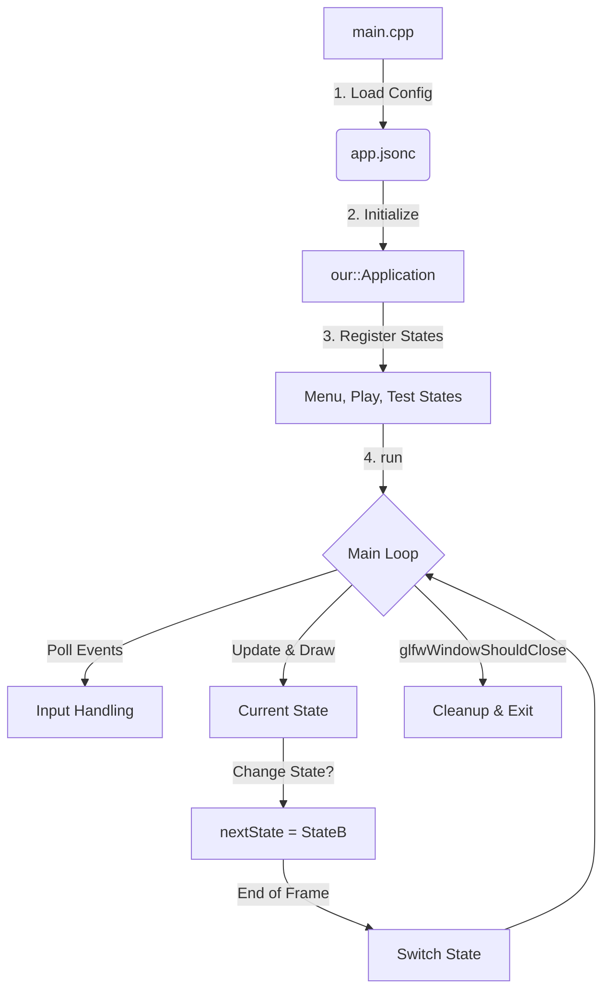
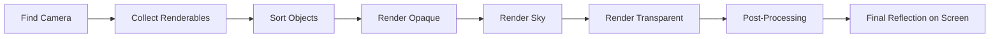

# Graphics Engine Project

A custom 3D Graphics Engine built using C++, OpenGL 3.3, and GLFW. This project implements a complete rendering pipeline, from basic shader management to a complex Entity-Component-System (ECS) framework with forward rendering and post-processing.

## 🚀 Project Flow: From Input to Screen

This section describes how data and control flow through the engine in every frame.

### 1. The Global Life Cycle
The application follows a strict state-based architecture. 

### **The Heart of the Engine: `Application::run`**
This main loop coordinates everything. Every frame, it polls events, updates the current state, and swaps the buffers.

```cpp
while(!glfwWindowShouldClose(window)){
    glfwPollEvents(); // 1. Handle hardware events (keys, mouse)

    double current_frame_time = glfwGetTime();
    // 2. State-specific logic and drawing
    if(currentState) currentState->onDraw(current_frame_time - last_frame_time);
    last_frame_time = current_frame_time;

    glfwSwapBuffers(window); // 3. Push to screen
}
```



---

### 2. The Input Pipeline
How your keystrokes and mouse clicks reach the game logic.

1.  **Hardware Event**: You press a key or move the mouse.
2.  **GLFW**: Captures the OS event during `glfwPollEvents()`.
3.  **Application Callbacks**: `application.cpp` uses lambdas to bridge GLFW and our engine:
    ```cpp
    glfwSetKeyCallback(window, [](GLFWwindow* window, int key, int scancode, int action, int mods){
        auto* app = static_cast<Application*>(glfwGetWindowUserPointer(window));
        if(app) app->getKeyboard().keyEvent(key, scancode, action, mods);
    });
    ```
4.  **Input Classes**: The `our::Keyboard` and `our::Mouse` objects record state (pressed vs. released).
5.  **State Dispatch**: If the `currentState` overrides event functions, they are called immediately.
6.  **Polling**: During `onDraw`, states poll for input:
    ```cpp
    if(keyboard.justPressed(GLFW_KEY_SPACE)) {
        getApp()->changeState("play");
    }
    ```

---

### 3. State Scenarios: Menu vs. Play

The engine behaves differently depending on whether you are in a UI state or a Game state.

#### **Scenario A: The Menu State**
*   **Logic**: Simple hit-detection. It checks if the `mousePosition` is inside a `Button` rectangle.
*   **Rendering**: Directly renders a 2D rectangle with the `menuMaterial`.
    ```cpp
    menuMaterial->setup(); // Sets shader, texture, and sampler
    menuMaterial->shader->set("transform", VP * M);
    rectangle->draw();
    ```
*   **Safety**: Uses null-checks for safety:
    ```cpp
    if(texture) texture->bind();
    if(sampler) sampler->bind(0);
    ```

#### **Scenario B: The Play State (ECS)**
*   **Logic**: Uses the **Entity-Component-System (ECS)**.
    *   **World**: A container of all **Entities**.
    *   **Components**: Data attached to entities (Camera, MeshRenderer, Movement).
    *   **Systems**: Logic that operates on the world (MovementSystem, FreeCameraController).
*   **Flow**:
    1.  `MovementSystem::update`: Updates entity positions based on velocity.
    2.  `CameraSystem::update`: Moves the camera based on user input.
    3.  `ForwardRenderer::render`: The heavy lifter.

---

### 4. The Rendering Pipeline (Forward Renderer)
When `renderer.render(&world)` is called, the following steps occur inside the GPU:



1.  **Collection**: Finds every entity with a `MeshRendererComponent`.
2.  **Sorting**: Correct blending requires back-to-front rendering for transparency.
    ```cpp
    // Sorting Transparent objects by distance from camera
    std::sort(transparentCommands.begin(), transparentCommands.end(), 
        [](const RenderCommand& a, const RenderCommand& b) {
            return a.depth > b.depth;
        }
    );
    ```
3.  **Opaque Pass**: Draws solid objects first.
4.  **Sky Pass**: Rendered with special depth logic (`glDepthFunc(GL_LEQUAL)` and `z=1`).
5.  **Transparent Pass**: Draws objects with alpha blending.
6.  **Post-Processing**: Final effects (Vignette, Grayscale) applied to a full-screen quad.

---

### 5. Screen Reflection
The final step in the frame is **Double Buffering**.
*   All drawing happens on a "back buffer" (invisible).
*   `glfwSwapBuffers(window)` is called.
*   The back buffer becomes the "front buffer" and is reflected on your monitor.

## 🛠️ Requirements & Build
*   **Compiler**: C++17 support (VS 2017+, GCC 9+, Clang 5+).
*   **Dependencies**: CMake, OpenGL 3.3, GLFW, GLAD, GLM, stb_image, JSON for Modern C++.

To run:
```powershell
./bin/GAME_APPLICATION.exe
```
