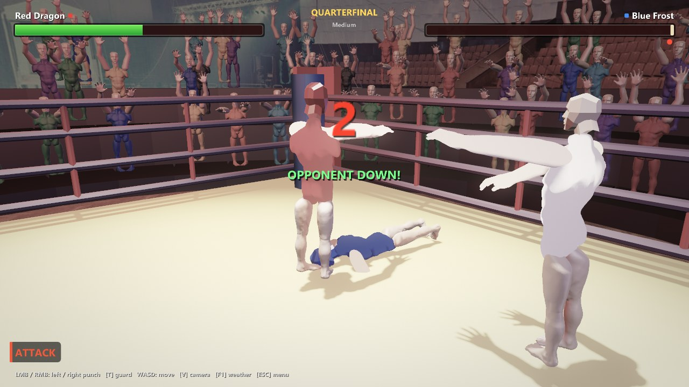
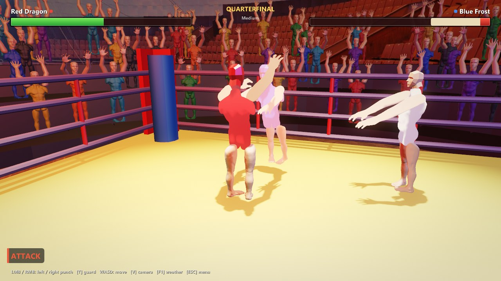
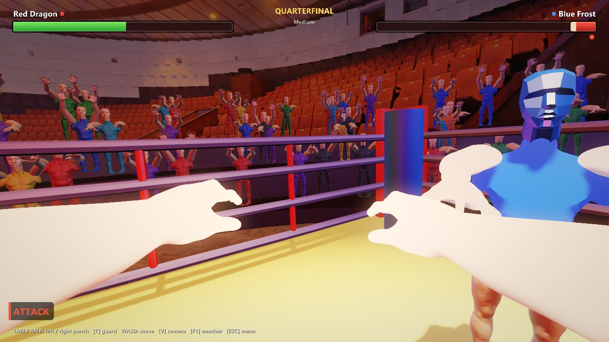
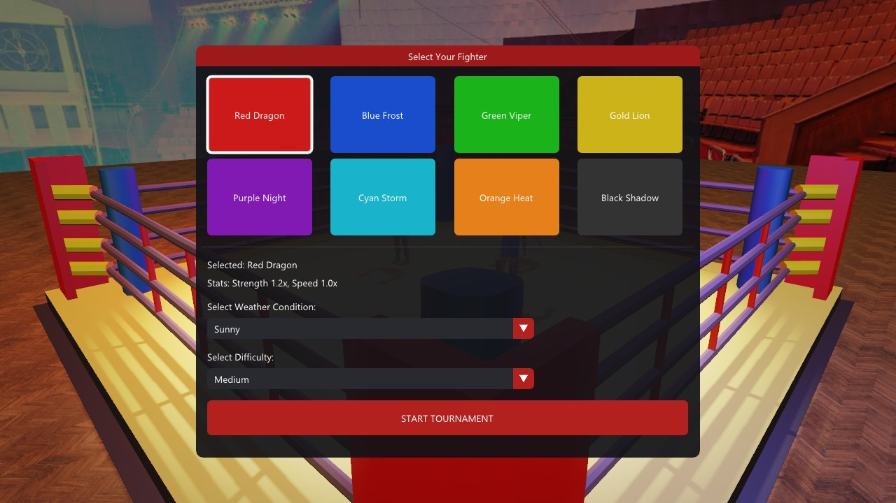
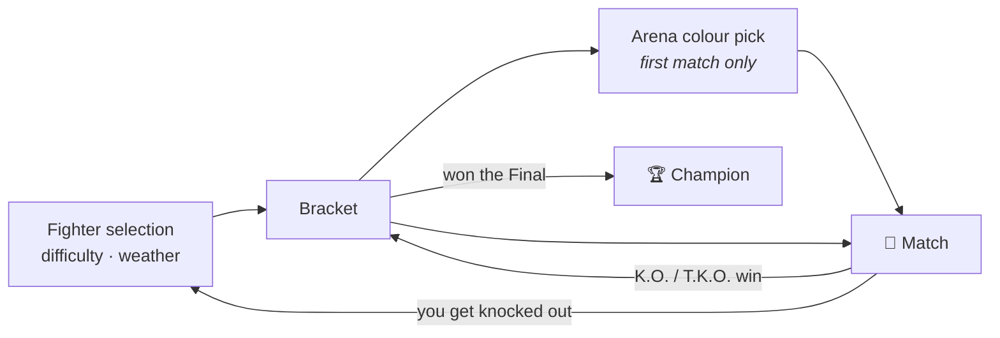
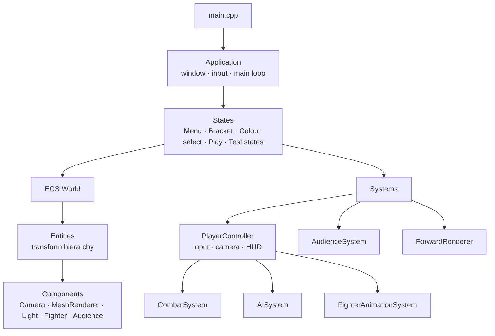
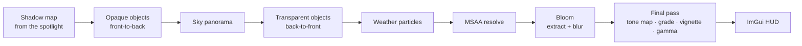

<div align="center">

---

## ✨ Highlights

<table>
<tr>
<td width="50%" valign="top">

## 📸 Screenshots

|             Knockdown & referee count             |         The crowd goes wild         |
| :------------------------------------------------: | :----------------------------------: |
|        |  |
|            **First-person mode**            |     **Fighter selection**     |
|  |    |

## 🕹️ Controls

| Action                                | Input                                                                                                |
| ------------------------------------- | ---------------------------------------------------------------------------------------------------- |
| Move (relative to the camera)         | **W A S D**                                                                                    |
| Left / right punch*(attack stance)* | **Left / Right mouse button**                                                                  |
| Switch attack ⇄ guard stance         | **T**                                                                                          |
| Full guard*(guard stance)*          | no button held — blocks everything, takes a little chip damage                                      |
| Parry left / right*(guard stance)*  | **hold Left / Right mouse button** — guard the side the punch comes from to stun the attacker |
| Get up after a knockdown              | **mash X**                                                                                     |
| Broadcast camera ⇄ first person      | **V**                                                                                          |
| Cycle weather                         | **F1**                                                                                         |
| Screenshot                            | **F12** (saved to `screenshots/`)                                                            |
| Back to menu / quit                   | **Esc**                                                                                        |

> 💡 **Tip:** the AI pulls its arm back before every punch — that is your window to raise your guard.
> Catching an opponent in the middle of their own punch deals a **COUNTER** hit for 1.5× damage.

## 🚀 Getting Started

### Requirements

- **CMake 3.5+**
- A **C++17** compiler — Visual Studio 2017+ (MSVC), GCC 9+ or Clang 5+
- A GPU with **OpenGL 3.3** support

All libraries are bundled in [`vendor/`](vendor) — nothing else to install.
On **Linux** you also need the OpenGL / X11 development packages:

```bash
sudo apt install build-essential cmake libgl1-mesa-dev libglew-dev \
                 libx11-dev libxrandr-dev libxinerama-dev libxcursor-dev libxi-dev
```

### Build

```bash
git clone https://github.com/asermohamed1/Graphics-Project.git
cd Graphics-Project
cmake -S . -B build -DCMAKE_BUILD_TYPE=Release
cmake --build build --config Release
```

Using **VS Code**? Open the folder with the *CMake Tools* extension, pick a compiler kit and press **Build**.

### Run

Always run the game **from the project root** (asset paths are relative to it):

```bash
./bin/GAME_APPLICATION            # Linux
./bin/GAME_APPLICATION.exe        # Windows
```

| Option        | Meaning                                                     | Example                             |
| ------------- | ----------------------------------------------------------- | ----------------------------------- |
| `-c=<file>` | Configuration / scene to load (default`config/app.jsonc`) | `-c=config/sky-test/test-0.jsonc` |
| `-f=<n>`    | Close automatically after*n* frames (used by the tests)   | `-f=2`                            |

## 🏆 How a Tournament Plays Out


```mermaid
flowchart LR
    A[Fighter selection<br/>difficulty · weather] --> B[Bracket]
    B --> C[Arena colour pick<br/><i>first match only</i>]
    C --> D[🥊 Match]
    B --> D
    D -- "K.O. / T.K.O. win" --> B
    D -- "you get knocked out" --> A
    B -- "won the Final" --> E[🏆 Champion]
```

| Round        | Opponent        | Style              |
| ------------ | --------------- | ------------------ |
| Quarterfinal | 🔵 Blue Frost   | fast               |
| Semifinal    | 🟡 Gold Lion    | heavy hitter       |
| Final        | ⚫ Black Shadow | strong*and* fast |

Opponents get stronger every round, on top of the difficulty you picked.

## 🧱 Engine Architecture

The engine uses an **Entity-Component-System** design and a **state machine** for the screens.
Scenes, materials and lights are all described in JSON ([`config/app.jsonc`](config/app.jsonc)).


```mermaid
flowchart TB
    main[main.cpp] --> app[Application<br/>window · input · main loop]
    app --> states[States<br/>Menu · Bracket · Colour select · Play · Test states]
    states --> world[ECS World]
    world --> ent[Entities<br/>transform hierarchy]
    ent --> comp[Components<br/>Camera · MeshRenderer · Light · Fighter · Audience]
    states --> systems[Systems]
    systems --> pc[PlayerController<br/>input · camera · HUD]
    pc --> combat[CombatSystem]
    pc --> ai[AISystem]
    pc --> anim[FighterAnimationSystem]
    systems --> aud[AudienceSystem]
    systems --> fr[ForwardRenderer]
```

### One frame of rendering


```mermaid
flowchart LR
    S[Shadow map<br/>from the spotlight] --> O[Opaque objects<br/>front-to-back] --> K[Sky panorama] --> T[Transparent objects<br/>back-to-front] --> W[Weather particles]
    W --> R[MSAA resolve] --> B[Bloom<br/>extract + blur] --> P[Final pass<br/>tone map · grade · vignette · gamma] --> U[ImGui HUD]
```

All "enhanced" features are switched on per scene from the renderer config, so the original
requirement scenes keep rendering exactly as specified:

```jsonc
"renderer": {
  "sky": "assets/textures/arena/arena_panorama.jpg",
  "postprocess": "assets/shaders/postprocess/arena-final.frag",
  "hdr": true,
  "msaa": 4,
  "bloom":   { "strength": 0.09, "threshold": 1.1 },
  "shadows": { "size": 2048 },
  "ambient": { "sky": [0.03, 0.03, 0.04], "ground": [0.018, 0.013, 0.01] },
  "fog":     { "color": [0.012, 0.01, 0.012], "density": 0.022 },
  "weather": true
}
```

## 📁 Project Structure

```
Graphics-Project/
├── assets/
│   ├── audio/          # punches, crowd cheer, referee count
│   ├── models/         # fighter body parts, ring, primitives (+ *_lod.obj for the crowd)
│   ├── shaders/        # GLSL: lit, shadow, sky, weather, post-processing
│   └── textures/       # arena panorama, parquet floor, ring
├── config/             # app.jsonc (the game) + one folder per requirement test
├── source/
│   ├── main.cpp
│   ├── common/
│   │   ├── components/ # Camera, MeshRenderer, Light, Fighter, Audience…
│   │   ├── ecs/        # Entity, Transform, World
│   │   ├── material/   # Materials & pipeline state
│   │   ├── mesh/       # Mesh + OBJ loader
│   │   ├── shader/     # Shader program (with #include support)
│   │   ├── systems/    # Renderer, combat, AI, animation, audience, player controller
│   │   └── texture/    # Textures, samplers, screenshots
│   └── states/         # Menu, bracket, play and the requirement test states
├── expected/           # Reference images for the automated tests
├── scripts/            # Test runner & image comparison
├── tools/              # Python asset tools (LOD generation, model fixes)
└── vendor/             # GLFW, GLAD, GLM, Dear ImGui, utilities
```

## ✅ Automated Tests

Every engine requirement (shaders, meshes, transforms, pipeline state, textures, samplers,
materials, ECS, renderer, sky, post-processing) has reference images in [`expected/`](expected).
On Windows, run from the project root:

```powershell
./scripts/run-all.ps1        # renders every test scene into screenshots/
./scripts/compare-all.ps1    # compares them with the expected images
```

Current result: **56 / 56 tests pass.**
The comparison tool `imgcmp` is in [`scripts/`](scripts) (see `scripts/README-IMPORTANT.txt` for Linux).

## ⚡ Performance

Around **160 FPS at 1280×720** with every effect on (RTX 4060 Laptop), with ~1 300 entities on screen.
The main tricks:

- **Crowd LODs** — spectators use decimated meshes ([`tools/generate_lods.py`](tools/generate_lods.py)),
  cutting the crowd from ~87 million triangles per frame down to ~1.1 million
- **Uniform location caching** and lights uploaded **once per shader per frame**
- **Front-to-back sorting** of opaque objects so hidden pixels are never shaded
- **Frustum-culled shadow pass** — only objects under the spotlight are drawn into the shadow map
- **Half-resolution bloom** with a separable, bilinear-optimized Gaussian blur

## 👥 Team

<table>
  <tr>
    <td align="center" width="25%">
      <a href="https://github.com/Beshoy-Sorial">
        <br>
        <b>Beshoy Sorial</b>
      </a><br>
      <sub>@Beshoy-Sorial</sub>
    </td>
    <td align="center" width="25%">
      <a href="https://github.com/asermohamed1">
        <br>
        <b>asermohamed1</b>
      </a><br>
      <sub>@asermohamed1</sub>
    </td>
    <td align="center" width="25%">
      <a href="https://github.com/Mohamed-Kamal0">
        <br>
        <b>Mohamed Kamal</b>
      </a><br>
      <sub>@Mohamed-Kamal0</sub>
    </td>
    <td align="center" width="25%">
      <a href="https://github.com/yaraFarouk">
        <br>
        <b>Yara Ahmed Farouk</b>
      </a><br>
      <sub>@yaraFarouk</sub>
    </td>
  </tr>
</table>

## 🙏 Credits

**Assets** (CC0, from [Poly Haven](https://polyhaven.com)):

- *Circus Arena* panorama — Oliksiy Yakovlyev
- *Herringbone Parquet* — Sergej Majboroda & Jenelle van Heerden

**Libraries:**
[GLFW](https://www.glfw.org/) ·
[GLAD](https://github.com/Dav1dde/glad) ·
[GLM](https://github.com/g-truc/glm) ·
[Dear ImGui](https://github.com/ocornut/imgui) ·
[stb_image](https://github.com/nothings/stb) ·
[tinyobjloader](https://github.com/tinyobjloader/tinyobjloader) ·
[nlohmann/json](https://github.com/nlohmann/json) ·
[miniaudio](https://miniaud.io/) ·
[flags](https://github.com/sailormoon/flags)

<div align="center">
